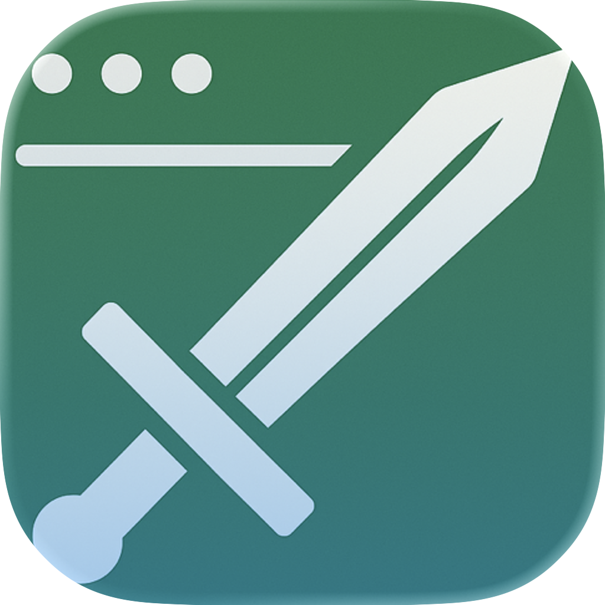

# Slaynode

<div align="center">



**A sleek macOS menu bar application for Node.js process management**

[](https://swift.org)
[](https://apple.com/macos)
[](LICENSE)

</div>

## ✨ Features

- 🎯 **Process Monitoring** - Real-time monitoring of all Node.js processes
- ⚡ **Quick Actions** - Kill, restart, or inspect processes with one click
- 🎨 **Beautiful Interface** - Native macOS design with smooth animations
- 🔔 **Smart Notifications** - Get notified about process changes
- 🌙 **Menu Bar Integration** - Always accessible from your menu bar
- 🌐 **English Localization** - Full English language support
- 🔒 **Secure & Private** - No telemetry, your data stays on your Mac

## 📸 Screenshots

### Menu Bar Interface
*(Add screenshot of the menu bar interface)*

### Process Management
*(Add screenshot of process management view)*

## 🚀 Quick Start

### Prerequisites

- macOS 13.0 or later
- Xcode Command Line Tools
- Swift 5.9+

### Installation

1. **Clone the repository**
   ```bash
   git clone https://github.com/yourusername/slaynode.git
   cd slaynode
   ```

2. **Build the application**
   ```bash
   ./build.sh
   ```

3. **Launch the app**
   ```bash
   open Slaynode.app
   ```

That's it! 🎉 The app will appear in your menu bar and start monitoring Node.js processes automatically.

## 🛠️ Development

### Project Structure

```
Slaynode/
├── Sources/
│   └── SlayNodeMenuBar/
│       ├── Resources/
│       │   ├── AppIcon.iconset/             # Liquid Glass app icon sources
│       │   ├── Assets.xcassets/             # Template menu bar glyph + misc assets
│       │   └── icon-iOS-Default-1024x1024@1x.png
│       ├── SlayNodeMenuBarApp.swift        # Main app entry point + AppKit bridge
│       ├── StatusItemController.swift      # Menu bar integration (popover)
│       ├── ProcessMonitor.swift          # Process monitoring logic
│       ├── MenuViewModel.swift           # UI state management
│       ├── MenuContentView.swift         # Main UI view
│       └── ...                           # Other components
├── generate-icons.swift                 # Utility to regenerate app/menu bar icons
├── Tests/                                # Unit tests
├── build.sh                            # Build script
├── Package.swift                       # Swift Package Manager
└── README.md                           # This file
```

### Building from Source

The project uses **Swift Package Manager** for dependency management.

#### Development Build
```bash
swift build
```

#### Release Build with .app Bundle
```bash
./build.sh release
```

#### Running Tests
```bash
swift test
```

## 🎨 Icon System

Slaynode’s visual identity is now aligned with the macOS 26 “Liquid Glass” aesthetic:

### App Icon
- **Source**: `Sources/SlayNodeMenuBar/Resources/SlayNodeIcon.png` (1024² master artwork)
- **Pipeline**: `swift generate-icons.swift` downscales the master image into the full `.iconset` (16×16 → 512×512 + Retina).
- **Sizes**: 16×16 → 512×512 with @2× Retina variants, plus 1024×1024 marketing size.

### Menu Bar Icon
- **Asset**: `Sources/SlayNodeMenuBar/Resources/Assets.xcassets/MenuBarIcon.imageset`
- **Format**: 22 pt monochrome template PNG (1×/2×) derived from `SlayNodeIcon.png` for automatic system tinting.
- **Regeneration**: `swift generate-icons.swift`

### Icon Refresh Workflow
1. Run `swift generate-icons.swift` to rebuild all PNG variants.
2. (Optional) Export an `.icns` for external use:  
   `iconutil -c icns Sources/SlayNodeMenuBar/Resources/AppIcon.iconset`
3. Build the project (`./build.sh` or `xcodebuild`) to bundle the refreshed assets.
4. Launch the app and confirm tinting/contrast in both light and dark wallpapers.

## 🔧 Configuration

### Preferences

The app stores preferences in:
```bash
~/Library/Containers/com.slaynode.menubar/Data/Library/Preferences/
```

### Supported Commands

- **Refresh**: `⌘R` - Refresh process list
- **Preferences**: `⌘,` - Open settings
- **Quit**: `⌘Q` - Quit application

## 🐛 Troubleshooting

### Common Issues

**Q: App shows "damaged" error**
```bash
# Fix permissions and code sign
chmod +x Slaynode.app/Contents/MacOS/SlayNodeMenuBar
codesign --force --sign - Slaynode.app
```

**Q: Menu bar icon doesn't appear**
- Check that the app is running in Activity Monitor
- Try restarting the app: `killall SlaynodeMenuBar && open Slaynode.app`

**Q: No Node.js processes detected**
- Ensure Node.js processes are actually running
- Check app permissions in System Settings > Privacy & Security

### Logs

Debug logs are available in Console.app:
```
Category: SlayNodeMenuBar
Process: SlayNodeMenuBar
```

## 🧪 Visual Verification Checklist

After regenerating icons or tweaking the Liquid Glass UI, validate the experience on a macOS 26 machine:

1. **Wallpaper Sweep** – Toggle between light, dark, and vivid HDR wallpapers. In *System Settings ▸ Appearance ▸ Menu Bar*, switch between transparent and backed styles and confirm the menu bar glyph remains legible.
2. **Control Center Roundtrip** – Command-drag the Slaynode icon off the menu bar, re-enable it via *System Settings ▸ Control Center ▸ Menu Bar Only Apps*, and verify the app state survives the cycle.
3. **Transparency Toggle** – Enable/disable “Automatically hide and show the menu bar” and observe hover/pressed states, panel shadows, and blur fidelity in both configurations.
4. **Appearance Modes** – Switch between Light, Dark, and Auto; spot-check header/secondary text contrast with Digital Color Meter to keep ≥4.5:1 against underlying wallpapers.
5. **Multi-Display** – Open the extra on a secondary display and ensure the panel shadow and blur adapt to each wallpaper without clipping.
6. **Menu Bar Height Variants** – Increase menu bar size in *System Settings ▸ Accessibility ▸ Display*; the 22 pt template glyph should scale crisply (macOS will pick the 2× asset automatically).

## 🤝 Contributing

We welcome contributions! Here's how you can help:

1. **Fork the repository**
2. **Create a feature branch**
   ```bash
   git checkout -b feature/amazing-feature
   ```
3. **Commit your changes**
   ```bash
   git commit -m "feat: Add amazing feature"
   ```
4. **Push to the branch**
   ```bash
   git push origin feature/amazing-feature
   ```
5. **Open a Pull Request**

### Development Guidelines

- Follow Swift coding conventions
- Write unit tests for new features
- Update documentation as needed
- Ensure icons work in both light and dark mode

## 📄 License

This project is licensed under the MIT License - see the [LICENSE](LICENSE) file for details.

## 🙏 Acknowledgments

- Thanks to the Swift community for excellent tools and libraries
- Icon design inspired by modern macOS design principles
- Built with ❤️ for developers worldwide

## 📞 Support

- 📧 Email: support@slaynode.app
- 🐛 Issues: [GitHub Issues](https://github.com/yourusername/slaynode/issues)
- 💬 Discord: [Join our community](https://discord.gg/slaynode)

---

<div align="center">

**Made with ❤️ for the Node.js community**

[⭐ Star this repo](https://github.com/yourusername/slaynode) • [🐛 Report Issues](https://github.com/yourusername/slaynode/issues) • [💬 Start Discussion](https://github.com/yourusername/slaynode/discussions)

</div>
